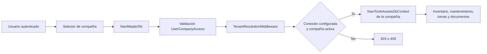

# Arquitectura multicompañía

## Modelo

NAVI adopta una base maestra y una base operativa aislada por compañía.

`NaviMasterDb` contiene:

- `Companies`;
- `CompanyDatabases`;
- `UserCompanyAccesses`;
- `CompanySchemaVersions`;
- `CompanyBackups`;
- `CompanyImportJobs`.

Las cadenas reales no se almacenan en esas tablas. `CompanyDatabase.ConnectionKey` referencia
una clave externa con formato `TenantDatabases:<ConnectionKey>`.

## Resolución por request

1. JWT Bearer autentica al usuario y valida la sesión contra la base de seguridad heredada.
2. `TenantResolutionMiddleware` lee `UserId` y `CompanyId` firmados.
3. `TenantAccessValidator` comprueba acceso, compañía activa y base en estado `Ready`.
4. La conexión se obtiene desde configuración segura.
5. `TenantContext` queda inmutable durante el request.
6. `NaviToolsAssetsDbContext` se configura con esa conexión al resolverse.

No se acepta `CompanyId` libre desde headers, body o query para resolver la conexión. El endpoint
de selección valida el acceso y emite un JWT nuevo con la compañía firmada.

## Compatibilidad progresiva

`Tenancy:Enabled` permanece en `false` por defecto. En ese modo NAVI usa
`ConnectionStrings:NaviToolsAssetsDb` y conserva el comportamiento actual. Antes de activar:

1. aplicar la migración de `NaviMasterDb`;
2. registrar compañías y accesos;
3. aprovisionar las bases operativas;
4. configurar `TenantDatabases:*` en secretos;
5. probar aislamiento y jobs;
6. habilitar `Tenancy__Enabled=true`.

Las rutas `/api/auth`, `/api/companies` y `/health` son neutrales al tenant. Las demás rutas
autenticadas exigen compañía cuando el modo está activo.

## Selector

Admin Web muestra el selector únicamente cuando el usuario dispone de más de una compañía.
La selección:

- solo admite compañías autorizadas y activas;
- actualiza la sesión persistente;
- emite un token nuevo;
- actualiza el estado del circuito;
- conserva la selección para restaurar el circuito actual.

El access token continúa en `localStorage` por compatibilidad, riesgo descrito en
`docs/architecture/security.md`.

## Migraciones

Las migraciones maestras viven en `Infrastructure/Tenancy/Migrations` y usan historial en el
esquema `Master`. Las migraciones operativas siguen separadas en `Persistence/Migrations`.

Cada base operativa debe registrar su versión en `CompanySchemaVersions`. Nunca se deben recorrer
todas las compañías automáticamente al arrancar la API. Las actualizaciones deben ejecutarse
como una operación administrativa autorizada, auditable y reintentable.

## Jobs, caché y transacciones

- Todo job de compañía debe incluir `CompanyId` como argumento.
- El worker crea un scope, valida la compañía y resuelve la conexión en ese scope.
- Toda clave de caché debe incluir `CompanyId`.
- No existe transacción distribuida entre maestra y operativa. Se usa estado de aprovisionamiento
  y compensación.
- Una compañía solo puede pasar a `Active` después de validar conexión y esquema.

## Base plantilla

La plantilla debe construirse desde migraciones operativas y un seeder exclusivo de catálogos.
No puede copiar usuarios reales, contraseñas, tokens, documentos ni datos de otra compañía.

El código actual registra la compañía en estado `Provisioning` y una referencia de base en
`Pending`; no crea ni clona bases automáticamente. Esta restricción evita dejar recursos
parciales mientras no exista un ejecutor transaccional probado.

## Estado y pendientes

Implementado:

- modelo y migración de base maestra;
- acceso por usuario;
- selector y token con compañía;
- middleware de validación;
- `DbContext` dinámico por request;
- solicitud auditable de backup;
- referencia segura de conexión;
- prueba de conexión sin exponer secretos.

Pendiente antes de declarar la Fase 3 completa:

- migrar usuarios y sesiones globales desde la base heredada a `NaviMasterDb`;
- ejecutor probado para crear base, aplicar migraciones y sembrar catálogos;
- worker de backup, checksum, retención y descarga;
- restauración automatizada con controles;
- jobs Hangfire con resolución explícita de tenant;
- pruebas de aislamiento sobre dos bases SQL reales.
